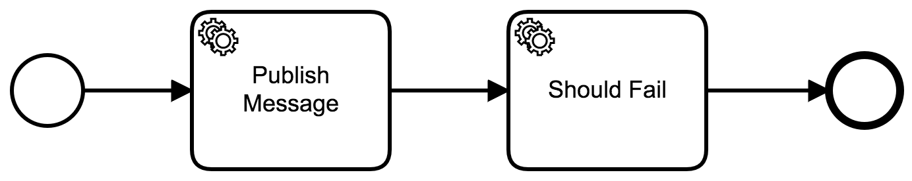

# Camunda and Kafka with Integrated Transaction
An example of Camunda and Kafka with transactional consistency.

## Show me the important parts!


## How does it work?

This simple process creates an entry in a custom JPA Entity called "Record" and then produces a message to Kafka ([ProduceMessageDelegate](src/main/java/com/example/workflow/delegate/ProduceMessageDelegate.java)).

This kafka message is then consumed and logged ([RecordConsumer](src/main/java/com/example/workflow/consumer/RecordConsumer.java)).

Since this process is executed in a single transaction (due to the fact that it has no wait states), any errors should rollback any changes done in the Camunda tables, record entity and kafka.

An error can occur in the process if a variable "shouldFail" is set to true ([ShouldErrorDelegate](src/main/java/com/example/workflow/delegate/ShouldErrorDelegate.java)).

This is achieved by configuring a ChainedKafkaTransactionManager, bringing both the default PlatformTransactionManager and KafkaTransactionManager. ([TransactionConfig](src/main/java/com/example/workflow/config/TransactionConfig.java))

## How to use it?
Start Apache Kafka in the default manner. Please check it here: https://kafka.apache.org/quickstart

You can execute the following command to run the application:

```
mvn spring-boot:run
``` 

The topics configuration is done automatically by the class [KafkaTopicConfig](src/main/java/com/example/workflow/config/KafkaTopicConfig.java).

You can start by executing a POST against the endpoint **http://localhost:8080/engine-rest/process-definition/key/CamundaKafkaTransaction/start** with the following request body:

```
{
    "businessKey":"someBusinessKey",
    "variables":{
        "shouldFail":{
            "value":"false",
            "type":"Boolean"
        }
    }
}
```

This will create an instance of the process showed above.

If the process runs successfully (shouldFail as false), you should see an entry in the table "Record", and a message like the following in the logs:

```
2020-12-08 10:36:21.886  INFO 92633 --- [ntainer#0-0-C-1] c.e.workflow.consumer.RecordConsumer     : *** Reading message someBusinessKey ***
```

Otherwise (shouldFail as true), you would see the exception stacktrace, but no entry in the table "Record" nor a message from the RecordConsumer.

## Environment Restrictions
This project uses Camunda 7.14.0-ee with Spring Boot.

## Known Limitations

## References

https://www.confluent.io/blog/transactions-apache-kafka
https://medium.com/@milo.felipe/spring-boot-kafka-transactions-97a2f653b60a